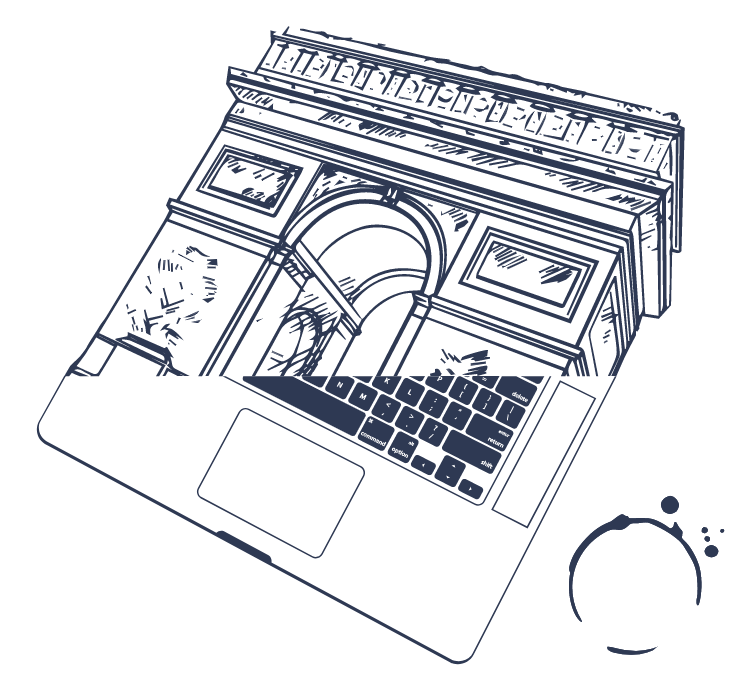

<!-- .slide: data-background="#2C374C" -->

# Rust

**In action** <!-- .element: class="grisFonce2" -->

Note:
    This is the speaker notes

---

## Cargo

The Rust package manager <!-- .element: class="beige" -->

--

### Cargo

* Bootstrap a project
* Build code
* Manage dependencies

--


Bootstrap

```bash
$ cargo new hello_cargo --bin
$ cd hello_cargo
$ tree .
.
├─ Cargo.toml
└─ src
    └─ main.rs
```

Build / run

```bash
$ cargo build
$ cargo run
```

--

## Exercises

 <!-- .element: class="borderless medium" -->

--

1. Create a new project with cargo
2. Execute it
3. Try to change ```src/main.rs``` 

```rust
println!("Hello, world!");
// to 
println("Hello, world!");
```

and build it   


